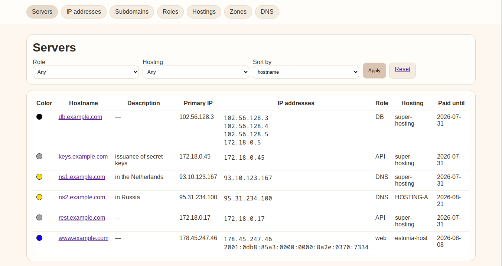

Made possible by [VPN-TIME](https://vtime.pro/) — a pay-as-you-go VPN service.



[Руководство администратора на русском](doc/README_RU.md)

# Что такое SINVER?

Это простое веб-приложение для инвентаризации серверов и управления DNS-записями.

Хранит информацию:
- о серверах;
- их IP-адресах;
- поддоменах;
- хостингах, на которых они развернуты;
- обновлении записей на DNS-серверах.

Приложение не предполагает механизмы аутентификации, пользователей и т. д.

Поэтому:
- допускается только локальный запуск непосредственно перед использованием;
- приложение слушает только `127.0.0.1`.

## Защита от CSRF

Все POST-формы содержат случайный CSRF-токен, привязанный к подписанной
браузерной сессии. Перед обработкой любого запроса, кроме GET, HEAD и OPTIONS,
сервер проверяет поле `csrf_token`. Отсутствующий, неверный или принадлежащий
другой сессии токен приводит к HTTP 400 без выполнения операции.
Проверка распространяется и на preview, принудительное продолжение и применение
изменений PowerDNS. Cookie сессии использует `HttpOnly` и `SameSite=Lax`.

После перезапуска приложения нужно обновить открытые страницы перед отправкой
форм: ключ подписи сессии создаётся заново при запуске. CSRF-защита не заменяет
ограничение доступа к приложению через localhost.

Проверка: `python -m unittest discover -s tests -v` (требуется Flask).

## Роли

Роли можно назначать:
- серверам;
- IP-адресам;
- поддоменам.

У каждой роли может быть цвет.

При этом:

- если у IP-адреса нет роли, то ему выставляется цвет роли сервера;
- если у поддомена нет роли, то ему выставляется цвет роли IP-адреса.

## Обновление зон на DNS-серверах

Поддерживаются записи A и AAAA. SOA формируется из параметров зоны. Другие типы DNS-записей пока не поддерживаются. При обновлении PowerDNS существующие записи других типов сохраняются.

### Для PowerDNS

Предполагается, что все PowerDNS-серверы используют PostgreSQL.
SINVER умеет напрямую обновлять записи в PostgreSQL.

Когда пользователь нажимает "Push", происходит следующее:

1) sinver получает информацию о зоне из SQLite (таблица zones): Зона(поле zone), SERIAL, параметры подключения к PostgreSQL.
2) В PostgreSQL обращается к таблице domains, ищет id (чтобы name = zone)
3) В PostgreSQL обращается к таблице records и получает SOA-записи для этой зоны (domain_id = id из предыдущего пункта, type = "SOA"). Если SOA-записей несколько или нет вообще, то нужно вывести на страницу ошибку и завершить процесс. Если SOA-запись ровно одна — извлекается значение поля "content"
Запоминает domain_id
4) Парсит из значения поля "content" 3 элемент и таким образом получает значение SERIAL
5) Сравнивает SERIAL из SQLite и SERIAL из PostgreSQL;
6) Если SERIAL различаются, то для пользователя появляется предупреждение и кнопка "Все равно продолжить"
7) Если SERIAL одинаковые или пользователь нажал "Все равно продолжить" - продолжаем
8) Получаем из PostgreSQL строки таблицы "records", используя ранее полученный domain_id.
9) Формируем новый список строк для таблицы "records" из PostgreSQL на основе данных из SQLite. В этом же списке делаем новую SOA запись с новым SERIAL. Подставляем везде ранее полученный domain_id.
10) Формируем DIFF для нового и старого списка (SOA запись тоже участвует в DIFF)
11) Формируем запрос, который обновит записи в PostgreSQL в соответствии с новым списком (удалит ненужные/неправильные строки, добавит новые/правильные)
12) Выводим на страницу DIFF и запрос, просим пользователя подтвердить
13) Выполняем запрос к PostgreSQL (с лимитом времени 30 секунд)
14) Сообщаем пользователю о результате выполнения запроса (Успех или Ошибка и причина ошибки)
15) Только если запрос завершился успешно - обновляем SERIAL в SQLite

Каждый пункт должен тзательно логироваться (с помощью вывода в терминал)

в 9 пункте новая SOA запись формируется на основе полей таблицы Zones из SQLite (при этом SERIAL подменяется на новый):

- `MNAME`;
- `RNAME`;
- `SERIAL`;
- `REFRESH`;
- `RETRY`;
- `EXPIRE`;
- `MINIMUM`;

### Для Bind9

Просто формирует db-файлы для каждой зоны и выдает пользователю.
Генерируется новый Serial, но попадает только в db-файл.
В базе остается старый.
Пользователь должен сам опубликовать их на Bind-сервере.

## Serial

Имеет формат `YYMMDDhhmm`, где:
- `YY` — последние 2 цифры года;
- `MM` — месяц;
- `DD` — день;
- `hh` — часы;
- `mm` — минуты.

Формируется при обновлении зон,
но обновляется в таблице с зоной только в случае успешного обновления в PostgreSQL.

## Primary-адреса

У каждого сервера может быть только 1 primary адрес.

При этом:
- primary-адреса можно менять;
- для каждого primary IP-адреса автоматически формируется A- или AAAA-запись вида:

`ip A/AAAA <hostname>.<основная зона>`

## Собственная база

SINVER использует для хранения данных SQLite со следующей структурой.

Готовый SQL-скрипт инициализации: `database/init_db.sql`.

### Таблица «Зоны»

Содержит поля:
- `id`;
- `зона` (доменное имя);
- `MNAME`;
- `RNAME`;
- `SERIAL` (последний serial, с которым зона была обновлена в PowerDNS/PostgreSQL);
- `REFRESH`;
- `RETRY`;
- `EXPIRE`;
- `MINIMUM`;
- `описание` (текст до 1024 символов, переводы строк, разные языки);
- `psql адрес` (строка 256 символов, по умолчанию `null`);
- `имя базы данных` (строка 256 символов, по умолчанию `null`, если не задано — используется `powerdns`);
- `psql пользователь` (строка 256 символов, по умолчанию `null`);
- `psql пароль` (строка 256 символов, по умолчанию `null`).

Поля MNAME, RNAME, SERIAL, REFRESH, RETRY, EXPIRE, MINIMUM используются для формирования SOA записи и не могут быть пустыми.
### Таблица «Роли»

Содержит поля:
- `id`;
- `имя роли`;
- `описание`;
- `цвет` (код цвета).

### Таблица «Хостинги»

Содержит поля:
- `id`;
- `имя`;
- `ссылка` (на сайт хостинга);
- `описание` (текст до 1024 символов, переводы строк, разные языки);
- `оплачен до` (дата).

### Таблица «Сервера»

Содержит поля:
- `id`;
- `hostname`;
- `роль` (по умолчанию `null`);
- `хостинг`;
- `основная зона` (`id`);
- `описание` (текст до 1024 символов, переводы строк, разные языки).

### Таблица «IP-адреса»

Содержит поля:
- `id`;
- `тип` (IPv4 или IPv6);
- `IP`;
- `сервер`;
- `роль` (по умолчанию `null`);
- `is_primary` (`true` или `false`).

### Таблица «Поддомен»

Содержит поля:
- `id`;
- `тип` (тип DNS-записи);
- `поддомен`;
- `роль`;
- `зона`;

> Для поддержки сценария, когда один домен должен указывать сразу на несколько IP,
> связь с таблицей IP-адресов вынесена в отдельную таблицу.

### Таблица «Поддомен → IP»

Содержит поля:
- `id`;
- `поддомен`;
- `ip`.

Ограничения:
- уникальная пара (`поддомен`, `ip`), чтобы не допускать дубликаты;
- один поддомен может быть связан с несколькими IP;
- один IP может использоваться в нескольких поддоменах.

## Конфигурация

SINVER читает настройки из TOML-файла `/etc/sinver.toml`. Другой файл можно
указать параметром `--config`. Пути, заданные относительно, разрешаются от
каталога конфигурационного файла.

```toml
database_path = "/var/lib/sinver/sinver.sqlite"
database_backup_path = "/var/lib/sinver/backups"
http_addr = "127.0.0.1"
http_port = 8080
log_file = "/var/log/sinver/sinver.log"
```

Параметры `http_addr` и `http_port` необязательны: по умолчанию используются
`127.0.0.1` и `8080`. Остальные параметры обязательны.

## Установка

`make install` копирует актуальную схему из `database/init_db.sql` в
`/usr/share/sinver/init_db.sql`, а содержимое `database/migrations/` — в
`/usr/share/sinver/migrations/`. Установка не создаёт БД и не изменяет её содержимое.
Схема обновляется при каждой установке. Если прежняя установка выставила immutable,
перед обновлением снимите его: `sudo chattr -i /usr/share/sinver/init_db.sql`.

Обычная установка выполняется от root:

```bash
sudo make install
sudo systemctl enable --now sinver.service
```

Установщик создаёт системные группу и пользователя `sinver` средствами
`getent`, `groupadd --system` и `useradd --system` (shadow-utils, обычные
Linux-дистрибутивы). Home — `/var/lib/sinver`; каталог создаётся установщиком,
shell — доступный `nologin`, с резервным вариантом `/bin/false`.
Существующие пользователь и группа сохраняются: UID/GID и параметры учётной
записи не меняются. Для уже существующей учётной записи администратор должен
проверить, что она системная и не допускает интерактивный вход; UID/GID 0
установщик отклоняет. Повторная установка сохраняет содержимое `/etc/sinver.toml`,
но исправляет его владельца и права на `root:sinver 0640`.

| Путь | Владелец | Права |
| --- | --- | --- |
| `/usr/bin/sinver` | `root:root` | `0755` |
| `/usr/share/sinver/` и каталоги миграций | `root:root` | `0755` |
| Схема и файлы миграций | `root:root` | `0644` |
| `/etc/systemd/system/sinver.service` | `root:root` | `0644` |
| `/etc/sinver.toml` | `root:sinver` | `0640` |
| `/var/lib/sinver/` и `/var/log/sinver/` | `sinver:sinver` | `0750` |
| `/var/lib/sinver/backups/` и его подкаталоги | `sinver:sinver` | `0700` |
| Существующие файлы данных, backup и логов в этих каталогах | `sinver:sinver` | `0600` |

Сервис запускается с `User=sinver`, `Group=sinver` и `UMask=0077`: новая SQLite-БД,
её служебные файлы, backup и логи создаются от `sinver` с закрытыми правами.
Пользователя и группу `sinver` следует выделять только этому сервису: SQLite
может содержать пароль PostgreSQL. Код, схема и миграции доступны сервису только
для чтения. `make install` выполняет `systemctl daemon-reload`, но не запускает
и не перезапускает сервис автоматически.

Unit использует `NoNewPrivileges=true` и `ProtectSystem=full`: `/usr`, `/boot`
и `/etc` доступны только для чтения внутри сервиса. Запись в каталоги данных
и логов, исходящие TCP-соединения к PostgreSQL/PowerDNS и прослушивание
`127.0.0.1:8080` (либо другого непривилегированного порта) разрешены.
`ProtectSystem=strict` с фиксированными `ReadWritePaths` и `ProtectHome` не
применяются, чтобы сохранить пользовательские пути из конфигурации.
`PrivateTmp` не применяется, поскольку PostgreSQL может использовать Unix-сокет
в `/tmp`. Для ручного запуска используйте `umask 0077` и пользователя `sinver`.

### Обновление установки, работавшей от root

Перед повторной установкой остановите сервис: `sudo systemctl stop sinver.service`.
Установщик передаёт существующие данные, backup и логи внутри `/var/lib/sinver`
и `/var/log/sinver` пользователю `sinver` и закрывает их от других пользователей.
Содержимое файлов при этом сохраняется. После установки запустите сервис:
`sudo systemctl start sinver.service`.

Старые и нестандартные пути в конфиге не изменяются автоматически. Если конфиг
ещё использует `/var/sinver`, перед запуском передайте этот каталог сервису:

```bash
sudo chown -R sinver:sinver /var/sinver
sudo find /var/sinver -type d -exec chmod 0750 {} +
sudo find /var/sinver -type f -exec chmod 0600 {} +
sudo find /var/sinver/backups -type d -exec chmod 0700 {} +
```

Для других путей обеспечьте аналогичные владельцев и права, включая доступ
`sinver` к родительским каталогам. Изменяемые данные должны находиться вне
защищённых `/usr`, `/boot` и `/etc`.

### Staged-установка и пакеты

```bash
make DESTDIR=/path/to/package-root install
```

При непустом `DESTDIR` установщик работает без root, не вызывает `getent`,
`groupadd`, `useradd`, `chown` или `systemctl` в host-системе и не создаёт SQLite.
Права файлов выставляются как при обычной установке; владельцем в staging
остаётся пользователь сборки. Пакет должен назначить владельцев из таблицы
средствами упаковщика и обеспечить создание системной учётной записи на целевой
системе до назначения владельцев конфигу и данным. Скрипт настройки пакета также
должен сохранить существующий конфиг, исправить права существующих данных
и выполнить `systemctl daemon-reload` на целевой системе.

Текущая версия SINVER — `0.0.0`. При первом запуске bootstrap автоматически создаёт
отсутствующую БД и проверяет её. Существующие конфиги сохраняются, включая старые пути БД.
Неверная схема, более новая версия или ошибка миграции блокируют основной интерфейс:
по любому URL доступна страница Maintenance mode без подключения к таблицам приложения.
Для БД без служебной версии предполагается `0.0.0`: добавление метаданных требует
подтверждения в Web UI и предварительного backup. Ошибки пишутся в лог и stdout.
После исправления причины ошибки перезапустите SINVER. Backup сохраняется после успеха.

### Бэкапы SQLite

Перед каждым изменением SQLite-базы `sinver.py` автоматически создаёт резервную копию в каталоге `database_backup_path`.
Формат имени: `<имя_базы>.<YYYYMMDD_HHMMSS_microseconds>.bak`.

Проверка bootstrap и Maintenance mode: `python tests/maintenance_smoke.py` (требуется Flask).
Проверка staged-установки, прав и сохранения данных: `python3 tests/install_smoke.py`
(требуется GNU make; root не нужен).
