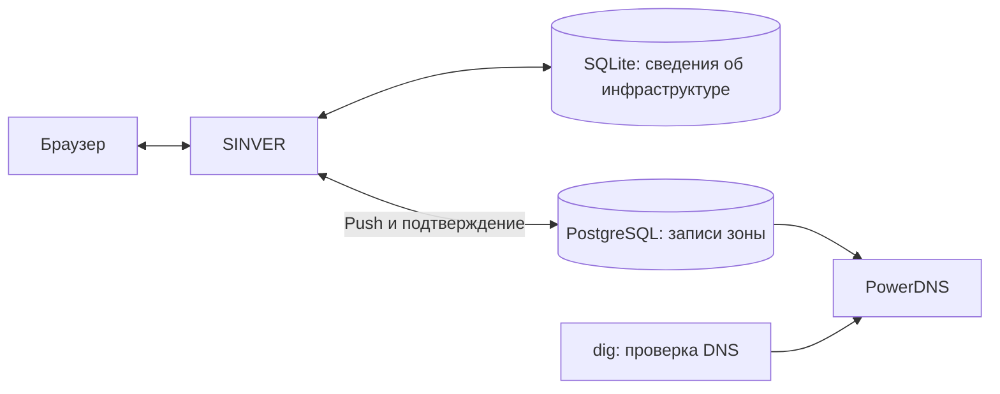

[Содержание](README_RU.md#содержание) · [Назад: О руководстве](README_RU.md) · [Далее: Конфигурация](02_Configuration_RU.md)

# 1. Быстрый старт

В этой главе вы установите SINVER, подготовите тестовую зону PowerDNS и опубликуете в ней записи первого сервера. Пример рассчитан на **Debian 12 с systemd**, доступом к пакетным репозиториям и правами `sudo`.

В данной инструкции все три компонента — SINVER, PostgreSQL и PowerDNS — устанавливаются на одной машине. PostgreSQL доступна на `127.0.0.1:5432`, PowerDNS отвечает на `127.0.0.1:53`, SINVER — на `127.0.0.1:8080`. Однако для эксплуатации настоятельно рекомендуем разделять управляющий и обслуживающий контуры: размещать SINVER отдельно, а авторитетные DNS-серверы — как минимум на двух независимых узлах.




> **Это MVP, версия 0.0.0.** Приложение находится на ранней стадии разработки. В нём нет встроенной аутентификации и разграничения доступа; для удалённой работы необходим защищённый вход через NGINX. Перед использованием с действующими DNS-зонами изучите [текущие проблемы](11_Current_Issues_RU.md) и проверьте работу на отдельной тестовой зоне.


## 1.1. Установка SINVER

Обновите список пакетов и установите Git, GNU Make, Python, Flask, драйвер PostgreSQL и утилиты для HTTP/DNS-проверок:

```bash
sudo apt update
sudo apt install git make python3 python3-flask python3-psycopg2 curl dnsutils
```

Python должен быть версии **3.11 или новее**: приложение использует встроенный модуль `tomllib`. Проверьте интерпретатор и зависимости:

```bash
/usr/bin/python3 --version
/usr/bin/python3 -c 'import flask, psycopg2, tomllib; print("Зависимости доступны")'
```

Ожидаемый результат на Debian 12: `Python 3.11.x` и строка `Зависимости доступны`. `ModuleNotFoundError` означает, что соответствующий пакет не установлен для этого интерпретатора.

Получите приложение и перейдите в его каталог:

```bash
git clone https://github.com/dvoropaev/SINVER.git
cd SINVER
```

Установите приложение и включите его запуск вместе с системой:

```bash
sudo make install
sudo systemctl enable --now sinver.service
```

`make install` создаёт непривилегированную служебную учётную запись `sinver`, копирует программу в `/usr/bin/sinver`, конфигурацию в `/etc/sinver.toml`, схему SQLite и миграции в `/usr/share/sinver/` и устанавливает unit systemd. Существующий конфигурационный файл сохраняется. `systemctl enable --now` включает автозапуск и запускает службу. При первом запуске SINVER сам создаёт SQLite-базу; вручную выполнять `init_db.sql` не требуется.

Проверьте службу и HTTP-интерфейс:

```bash
systemctl is-active sinver.service
curl -sS -o /dev/null -w '%{http_code}\n' http://127.0.0.1:8080/servers
```

Ожидаемый результат: `active` и `200`. Код `503` означает режим обслуживания БД; смотрите [обслуживание и восстановление](02_Configuration_RU.md). Если служба не запустилась, прочитайте сообщения systemd и журнал приложения:

```bash
sudo journalctl -u sinver.service -n 30 --no-pager
sudo tail -n 30 /var/log/sinver/sinver.log
```

При успешном запуске журнал приложения содержит `SINVER started successfully: http://127.0.0.1:8080`. При ошибке ищите сообщение о конфигурации, правах на файлы или состоянии БД; конкретный текст указывает причину.

На сервере с браузером откройте `http://127.0.0.1:8080`. Для доступа с другого компьютера выполните следующий раздел.

## 1.2. NGINX, HTTPS и вход по паролю — для доступа извне

**Этот раздел необязателен при локальной работе.** Для доступа извне NGINX принимает HTTPS-запросы, проверяет логин и пароль и передаёт запросы локальному SINVER. Все допущенные пользователи получают одинаковые права: Basic Auth не создаёт роли внутри приложения.

Для примера ниже нужно настоящее имя вместо `sinver.example.org`:

- его публичная A-запись должна указывать на внешний IPv4-адрес сервера;
- если есть AAAA-запись, сервер должен быть доступен также по этому IPv6;
- входящие TCP-порты `80` и `443` должны быть разрешены в межсетевом экране и, при наличии, NAT;
- в `/etc/sinver.toml` оставьте `http_addr = "127.0.0.1"`; порт `8080` не публикуйте.

Установите NGINX, утилиту создания пароля, Certbot и его плагин NGINX:

```bash
sudo apt install nginx apache2-utils certbot python3-certbot-nginx
```

Создайте файл паролей с учётной записью `admin`. Пароль вводится интерактивно:

```bash
sudo htpasswd -c /etc/nginx/sinver.htpasswd admin
sudo chown root:www-data /etc/nginx/sinver.htpasswd
sudo chmod 640 /etc/nginx/sinver.htpasswd
```

Флаг `-c` **создаёт новый файл и перезаписывает старый**. Для добавления следующих пользователей вызывайте `htpasswd` без `-c`. Права дают NGINX возможность читать файл и закрывают доступ остальным пользователям ОС.

Откройте новый конфигурационный файл сайта:

```bash
sudoedit /etc/nginx/sites-available/sinver
```

На время выпуска сертификата сохраните такой HTTP-сайт, подставив своё доменное имя:

```nginx
server {
    listen 80;
    server_name sinver.example.org;

    location / {
        return 404;
    }
}
```

Пока сайт возвращает `404` и не передаёт запросы в SINVER. Certbot сам добавит настройки для проверки владения доменом. Если используете публичный IPv6, добавьте `listen [::]:80;`.

Включите сайт, проверьте синтаксис и примените конфигурацию:

```bash
sudo ln -s /etc/nginx/sites-available/sinver /etc/nginx/sites-enabled/sinver
sudo nginx -t
sudo systemctl reload nginx
```

Ссылку создают один раз. Ожидаемый итог `nginx -t`: `syntax is ok` и `test is successful`. При ошибке сначала исправьте названный файл и строку, затем повторите проверку.

Выпустите и установите сертификат с помощью certbot и плагина NGINX:

```bash
sudo certbot --nginx -d sinver.example.org --redirect
```

`--nginx` выбирает плагин для проверки домена и установки сертификата, `-d` задаёт доменное имя, `--redirect` включает перенаправление HTTP на HTTPS. Замените имя своим; в интерактивном диалоге укажите адрес электронной почты и прочитайте условия сервиса. Успешный результат содержит `Successfully received certificate`. Сертификат и ключ находятся в `/etc/letsencrypt/live/<ваше-имя>/`.

Снова откройте `/etc/nginx/sites-available/sinver` командой `sudoedit` и замените содержимое конфигурацией ниже. Подставьте настоящее имя в `server_name`, адрес перенаправления и оба пути сертификата:

```nginx
server {
    listen 80;
    server_name sinver.example.org;

    location / {
        return 301 https://sinver.example.org$request_uri;
    }
}

server {
    listen 443 ssl;
    server_name sinver.example.org;

    ssl_certificate /etc/letsencrypt/live/sinver.example.org/fullchain.pem;
    ssl_certificate_key /etc/letsencrypt/live/sinver.example.org/privkey.pem;
    ssl_protocols TLSv1.2 TLSv1.3;

    location / {
        auth_basic "SINVER";
        auth_basic_user_file /etc/nginx/sinver.htpasswd;

        proxy_pass http://127.0.0.1:8080;
        proxy_set_header Host $host;
        proxy_set_header X-Real-IP $remote_addr;
        proxy_set_header X-Forwarded-For $proxy_add_x_forwarded_for;
        proxy_set_header X-Forwarded-Proto $scheme;
        proxy_cookie_flags session secure;
    }
}
```

HTTP-сайт перенаправляет браузер на HTTPS. HTTPS-сайт предъявляет сертификат, требует пароль и передаёт запросы в SINVER. `proxy_cookie_flags` добавляет флаг `Secure` cookie сессии, чтобы браузер отправлял её только по HTTPS. При доступе по IPv6 добавьте `listen [::]:80;` и `listen [::]:443 ssl;` в соответствующие блоки.

Проверьте и примените итоговую конфигурацию:

```bash
sudo nginx -t
sudo systemctl reload nginx
curl -sS -o /dev/null -w '%{http_code}\n' http://sinver.example.org/servers
curl -sS -o /dev/null -w '%{http_code}\n' https://sinver.example.org/servers
curl -sS -u admin -D - -o /dev/null https://sinver.example.org/servers
```

Ожидается успешная проверка NGINX, затем `301` по HTTP, `401` по HTTPS без учётных данных и `200` с верным паролем. Последний `curl` запросит пароль; не записывайте его в командной строке. В заголовке `Set-Cookie` для `session` должны присутствовать `Secure`, `HttpOnly` и `SameSite=Lax`. Теперь можно открывать `https://<ваше-имя>` в браузере.

Включите таймер и проверьте пробное продление сертификата:

```bash
sudo systemctl enable --now certbot.timer
sudo certbot renew --dry-run
systemctl list-timers --all certbot.timer
```

Ожидаемый итог: сообщение об успешном пробном продлении всех сертификатов, например `all simulated renewals succeeded`, и запланированный запуск таймера. `--dry-run` проверяет процедуру, не заменяя рабочий сертификат. Certbot использует сохранённый плагин NGINX для последующих продлений. TCP-порт `80` должен оставаться доступным для проверок HTTP-01.

## 1.3. PostgreSQL и PowerDNS

**PowerDNS Authoritative Server** отвечает за записи вашей зоны. **PostgreSQL** хранит его зоны и записи. SINVER подключается прямо к этой БД; API PowerDNS в текущей версии не используется. Требуется PostgreSQL backend PowerDNS (`gpgsql`) с его штатной схемой.

Установите сервер PostgreSQL и PostgreSQL backend PowerDNS. Остановите PowerDNS до завершения настройки:

```bash
sudo apt install postgresql postgresql-client pdns-server pdns-backend-pgsql
sudo systemctl stop pdns.service
sudo systemctl enable --now postgresql.service
sudo ss -lntup 'sport = :53'
```

В выводе `ss` проверьте, свободен ли `127.0.0.1:53`. Служба, слушающая `0.0.0.0:53`, также займёт этот адрес. Если порт используется, сначала разберитесь с назначением другой DNS-службы и измените её настройки; не отключайте разрешение имён без замены.

Создайте владельца БД без возможности входа и отдельные учётные записи PowerDNS и SINVER. Откройте SQL-консоль администратора:

```bash
sudo -u postgres psql -v ON_ERROR_STOP=1
```

Сначала создайте роли и включите SCRAM-SHA-256 для задаваемых далее паролей:

```sql
CREATE ROLE powerdns_owner NOLOGIN;
CREATE ROLE pdns_reader LOGIN;
CREATE ROLE sinver_writer LOGIN;
SET password_encryption = 'scram-sha-256';
```

Задайте пароли по одной команде за раз:

```sql
\password pdns_reader
```

Введите новый пароль дважды и дождитесь возврата приглашения `postgres=#`. Затем задайте отдельный пароль для SINVER:

```sql
\password sinver_writer
```

Снова введите пароль дважды и дождитесь приглашения `postgres=#`. Не вставляйте следующие SQL-команды, пока `\password` ожидает ввод: это интерактивная команда `psql`, и вставленный текст может быть воспринят как пароль.

После установки обоих паролей продолжите настройку:

```sql
CREATE DATABASE powerdns OWNER powerdns_owner;
\connect powerdns
SET ROLE powerdns_owner;
\i /usr/share/pdns-backend-pgsql/schema/schema.pgsql.sql
RESET ROLE;

REVOKE ALL ON DATABASE powerdns FROM PUBLIC;
GRANT CONNECT ON DATABASE powerdns TO pdns_reader, sinver_writer;
REVOKE ALL ON SCHEMA public FROM PUBLIC;
GRANT USAGE ON SCHEMA public TO pdns_reader, sinver_writer;
GRANT SELECT ON ALL TABLES IN SCHEMA public TO pdns_reader;
GRANT SELECT ON TABLE domains TO sinver_writer;
GRANT SELECT, INSERT, DELETE ON TABLE records TO sinver_writer;
GRANT USAGE ON SEQUENCE records_id_seq TO sinver_writer;
\q
```

`SET ROLE` выполняет импорт схемы от имени её владельца, `RESET ROLE` возвращает права администратора, `\q` закрывает консоль. `ON_ERROR_STOP` прерывает выполнение при первой SQL-ошибке, но оставляет интерактивную консоль открытой. Если импорт завершился с ошибкой, не переходите к выдаче прав: сначала исправьте её и убедитесь, что схема создана полностью. Запомните отдельный пароль `sinver_writer`: он понадобится в карточке зоны SINVER.

**Схема берётся из установленного пакета backend, чтобы соответствовать его версии.** Для другого выпуска Debian проверьте путь через `dpkg -L pdns-backend-pgsql`. Не импортируйте `database/init_db.sql` из SINVER в PostgreSQL: это схема собственной SQLite-базы приложения.

| Учётная запись | Назначение и права |
| --- | --- |
| `powerdns_owner` | Владелец схемы без возможности входа; используется администратором при настройке |
| `pdns_reader` | PowerDNS читает таблицы. Пример использует зоны типа `NATIVE`, без управления зоной через API и без операций записи PowerDNS |
| `sinver_writer` | SINVER читает `domains`, читает, добавляет и удаляет `records`, получает новые значения `records_id_seq` |

Права `sinver_writer` распространяются на записи всех зон этой БД. Используйте отдельную базу для стенда и не подключайте приложение от имени `postgres`.

Проверьте вход обеих учётных записей через локальное TCP-подключение:

```bash
psql -h 127.0.0.1 -U pdns_reader -d powerdns -W -c 'SELECT count(*) FROM domains;'
psql -h 127.0.0.1 -U sinver_writer -d powerdns -W -c 'SELECT count(*) FROM records;'
```

Обе команды должны завершиться без ошибок и вернуть `0`. Если PostgreSQL не разрешает вход, узнайте путь к файлу правил:

```bash
sudo -u postgres psql -c 'SHOW hba_file;'
```

При необходимости добавьте в `pg_hba.conf` правила **перед** более общими правилами, которые могут перехватить подключения:

```text
host powerdns pdns_reader   127.0.0.1/32 scram-sha-256
host powerdns sinver_writer 127.0.0.1/32 scram-sha-256
```

Примените правила командой `sudo -u postgres psql -c 'SELECT pg_reload_conf();'` и повторите проверку. Стандартный локальный кластер Debian не требует изменения `listen_addresses`. SINVER не имеет поля порта PostgreSQL; в этой инструкции используется стандартный порт `5432`.

Откройте основной файл PowerDNS:

```bash
sudoedit /etc/powerdns/pdns.conf
```

Для новой тестовой установки замените содержимое следующим, подставив пароль `pdns_reader`:

```ini
launch=gpgsql
gpgsql-host=127.0.0.1
gpgsql-port=5432
gpgsql-dbname=powerdns
gpgsql-user=pdns_reader
gpgsql-password=ЗАМЕНИТЕ_ПАРОЛЕМ_PDNS_READER
local-address=127.0.0.1
local-port=53
```

`gpgsql-*` задают подключение PowerDNS к БД. `local-address` ограничивает DNS-ответы локальной машиной. Пример не подключает дополнительные файлы через `include-dir`; настройки из прежних подключаемых файлов здесь не используются. Для пароля избегайте переводов строк и символов, которые интерпретируются конфигурационным файлом как комментарий.

Закройте файл с паролем от посторонних:

```bash
sudo chown root:pdns /etc/powerdns/pdns.conf
sudo chmod 640 /etc/powerdns/pdns.conf
```

## 1.4. Создание тестовой DNS-зоны

**SINVER не создаёт зону в PowerDNS.** До первой отправки в таблице `domains` должна существовать зона с тем же именем, а в `records` — ровно одна SOA-запись этой зоны.

Следующие команды рассчитаны на PowerDNS **4.7/4.8**. Для PowerDNS 5.x [синтаксис `pdnsutil` изменён](https://doc.powerdns.com/authoritative/upgrading.html#pdnsutil-syntax-and-behaviour-changes).

Для настройки используйте отдельный временный файл: работающая служба сохраняет доступ к БД только на чтение. Создайте каталог и откройте файл:

```bash
sudo install -d -o root -g postgres -m 0750 /run/sinver-pdns-admin
sudoedit /run/sinver-pdns-admin/pdns.conf
```

Сохраните:

```ini
launch=gpgsql
gpgsql-host=/var/run/postgresql
gpgsql-dbname=powerdns
gpgsql-user=postgres
gpgsql-extra-connection-parameters=options='-c role=powerdns_owner'
```

Этот файл использует локальный Unix-сокет. Команды запускаются от системного пользователя `postgres`, которому стандартное правило `peer` Debian разрешает вход в PostgreSQL без пароля. Параметр `options` переключает SQL-сессию на `powerdns_owner`; права записи не выдаются учётной записи `pdns_reader`.

Разрешите чтение административной конфигурации только владельцу и группе `postgres`:

```bash
sudo chown root:postgres /run/sinver-pdns-admin/pdns.conf
sudo chmod 640 /run/sinver-pdns-admin/pdns.conf
```

Создайте зону `infra.example.net`, укажите её сервер имён и режим `NATIVE` — без передачи зоны вторичным серверам:

```bash
sudo -u postgres pdnsutil --config-dir=/run/sinver-pdns-admin create-zone infra.example.net ns1.infra.example.net
sudo -u postgres pdnsutil --config-dir=/run/sinver-pdns-admin set-kind infra.example.net NATIVE
sudo -u postgres pdnsutil --config-dir=/run/sinver-pdns-admin replace-rrset infra.example.net @ SOA 3600 'ns1.infra.example.net. hostmaster.infra.example.net. 1 3600 600 1209600 300'
sudo -u postgres pdnsutil --config-dir=/run/sinver-pdns-admin replace-rrset infra.example.net ns1 A 3600 192.0.2.53
sudo -u postgres pdnsutil --config-dir=/run/sinver-pdns-admin list-zone infra.example.net
sudo -u postgres pdnsutil --config-dir=/run/sinver-pdns-admin check-zone infra.example.net
```

`--config-dir` выбирает каталог административной конфигурации. `create-zone` создаёт зону с SOA/NS, `set-kind` задаёт тип, `replace-rrset` заменяет указанный набор записей, `list-zone` показывает итоговые записи, `check-zone` проверяет структуру зоны.

В PowerDNS 4.7/4.8 аргумент `NAME` команды `replace-rrset` обрабатывается как имя относительно зоны. Поэтому для вершины зоны здесь используется `@`, а для `ns1.infra.example.net` — относительное имя `ns1`. Не подставляйте в эти две команды соответственно `infra.example.net` и `ns1.infra.example.net`: в PowerDNS 4.7.3/4.8.x это может создать записи вида `infra.example.net.infra.example.net` и `ns1.infra.example.net.infra.example.net`.

В выводе `list-zone` должны присутствовать SOA и NS для `infra.example.net` и A-запись `ns1.infra.example.net`. Имен с повторяющимся суффиксом `.infra.example.net.infra.example.net` быть не должно. Только после этого переходите дальше.

SOA здесь имеет SERIAL `1`, REFRESH `3600`, RETRY `600`, EXPIRE `1209600`, MINIMUM `300`; их смысл разобран в [главе «Зоны»](09_Zones_RU.md). DNSSEC в этом стенде не включается.

После успешной проверки удалите временную административную конфигурацию и запустите PowerDNS:

```bash
sudo rm /run/sinver-pdns-admin/pdns.conf
sudo rmdir /run/sinver-pdns-admin
sudo systemctl enable --now pdns.service
systemctl is-active pdns.service
dig @127.0.0.1 infra.example.net SOA +norecurse
dig @127.0.0.1 infra.example.net NS +norecurse
```

Ожидается `active`, SOA с SERIAL `1`, NS `ns1.infra.example.net.` и флаг `aa` — авторитетный ответ. При другом результате прочитайте журнал:

```bash
sudo journalctl -u pdns.service -n 30 --no-pager
```

Ошибки подключения обычно указывают на имя БД, пароль или правила `pg_hba.conf`; `Address already in use` означает, что выбранный DNS-адрес и порт заняты. Не включайте `trust` и не открывайте PostgreSQL всему интернету для обхода ошибки.

Проверьте, что SINVER может прочитать созданную зону:

```bash
psql -h 127.0.0.1 -U sinver_writer -d powerdns -W -c 'SELECT name, type FROM domains;'
```

Ожидается строка `infra.example.net | NATIVE`. Ошибка `permission denied` требует проверки выданных прав; ошибка аутентификации — пароля и правил PostgreSQL для `127.0.0.1`.

Зона пока не делегирована в публичной DNS. Для публикации потребуются доступные серверы имён, их адреса A/AAAA, открытые UDP и TCP `53`, NS у регистратора и, для серверов внутри своей зоны, glue-записи у родительской зоны.

## 1.5. Первая зона и первый сервер в SINVER

Откройте **Zones**, заполните **Add zone** и нажмите **Create**:

| Поле | Значение |
| --- | --- |
| Zone | `infra.example.net` — без завершающей точки |
| MNAME | `ns1.infra.example.net.` |
| RNAME | `hostmaster.infra.example.net.` |
| SERIAL | `1` — как в ответе SOA выше |
| REFRESH / RETRY / EXPIRE / MINIMUM | `3600` / `600` / `1209600` / `300` |
| PostgreSQL address | `127.0.0.1` |
| DB name | `powerdns` |
| PostgreSQL user | `sinver_writer` |
| PostgreSQL password | Пароль `sinver_writer` |
| Description | `Тестовая зона` — необязательно |

`MNAME` — имя основного авторитетного DNS-сервера, записываемое в SOA. Для этого тестового стенда это `ns1.infra.example.net.`. Это DNS-имя, а не IP-адрес и не адрес сервера SINVER/PostgreSQL.

`RNAME` — контактный адрес администратора зоны в формате SOA: первая точка заменяет символ `@`. Например, `hostmaster.infra.example.net.` соответствует адресу `hostmaster@infra.example.net`.

Завершающие точки у `MNAME` и `RNAME` обозначают абсолютные DNS-имена и позволяют также корректно использовать экспорт BIND9. Имя самой зоны должно в точности совпадать с `domains.name` в PostgreSQL.

Создайте сервер на вкладке **Servers → Add server**:

| Поле | Значение |
| --- | --- |
| Hostname | `app-01` |
| Primary zone | `infra.example.net` |
| Role / Hosting | `None` — можно заполнить позже |
| Description | `Первый сервер приложения` — необязательно |

Нажмите **Create**. На вкладке **IP addresses → Add IP** добавьте его основной адрес:

| Поле | Значение |
| --- | --- |
| Type | `IPv4` |
| IP | `192.0.2.10` |
| Server | `app-01` |
| Role | `None` |
| Primary | `Yes` |

Нажмите **Create**. Основная зона сервера и основной IP формируют запись `app-01.infra.example.net A 192.0.2.10` при публикации.

На одном сервере допускается только один основной адрес суммарно для IPv4 и IPv6. Порядок его замены описан в [главе «IP-адреса»](05_IP_Addresses_RU.md).

**Добавьте в SINVER адрес сервера имён.** Тем же способом создайте сервер `ns1` с основной зоной `infra.example.net` и его основным IPv4 `192.0.2.53`. Без этой связи SINVER предложит удалить существующую A-запись `ns1`. NS-запись при этом сохраняется, поскольку SINVER не управляет типом NS.

Чтобы добавить удобное имя приложения:

1. На вкладке **Subdomains → Add subdomain** задайте **Type** `A`, **Name** `app`, **Zone** `infra.example.net`, **Role** `None` и нажмите **Create**.
2. Откройте созданную карточку по ссылке `app`, нажмите **Edit**.
3. Выберите `192.0.2.10` в **Linked IP addresses** и нажмите **Save**.

После привязки адреса SINVER будет формировать дополнительную запись `app.infra.example.net A 192.0.2.10`.

## 1.6. Отправка записей в PowerDNS

1. Откройте **DNS**, в блоке **PowerDNS + PostgreSQL** выберите `infra.example.net` и нажмите **Push**. Это подготовка плана; изменения ещё не применяются.
2. Сверьте **Remote SERIAL** и **Local SERIAL**. В примере оба равны `1`. При расхождении выясните причину до продолжения.
3. Изучите предварительный список изменений и SQL. Строки `+` обозначают добавление, строки `-` — удаление. Должны появиться A-записи `app-01` и `app`; SOA получит **New SERIAL**. A-запись `ns1` и NS должны сохраниться. Возможны замены записей из-за различий TTL или служебных значений.
4. Убедитесь, что **New SERIAL** больше прежнего. SINVER генерирует его по локальным часам с точностью до минуты и не проверяет увеличение; при повторной отправке в ту же минуту дождитесь следующей минуты и заново подготовьте план.
5. Если план соответствует намерению, нажмите **Confirm apply** и подтвердите диалог браузера. Ожидаемое сообщение: `PowerDNS update applied and local serial updated.`

План действует 10 минут; при истечении времени или перезапуске SINVER нажмите **Push** заново. В текущей версии выполняйте отправку одним администратором и не изменяйте зону между просмотром и подтверждением.

> **Проверяйте каждое удаление в плане.** SINVER управляет всеми A, AAAA и SOA выбранной зоны. Существующие A/AAAA, которые отсутствуют в данных приложения, попадут в план удаления. Остальные типы, включая NS, MX и TXT, сохраняются. Перед первой отправкой рабочей зоны перенесите в SINVER все её A/AAAA и сохраните резервную копию PostgreSQL. Полный порядок действий и обработка ошибок — в [главе «DNS»](10_DNS_RU.md).

У новых управляемых записей TTL равен `3600` секунд; изменить его через интерфейс или `sinver.toml` нельзя.

Для локальной проверки очистите DNS-кеш PowerDNS и запросите опубликованные записи:

```bash
sudo pdns_control purge 'infra.example.net$'
dig @127.0.0.1 app-01.infra.example.net A +short
dig @127.0.0.1 app.infra.example.net A +short
dig @127.0.0.1 ns1.infra.example.net A +short
dig @127.0.0.1 infra.example.net SOA +short
```

`purge` с суффиксом `$` очищает кеш записей этой зоны на данном PowerDNS. Первые три DNS-запроса должны вернуть `192.0.2.10`, `192.0.2.10` и `192.0.2.53`. В SOA должен быть SERIAL из поля **New SERIAL** подтверждённого плана и карточки зоны SINVER. Он имеет формат `YYMMDDhhmm`; время берётся с хоста SINVER. При пустом выводе повторите `dig` без `+short`, чтобы увидеть статус ответа или сообщение о недоступности сервера.

Рекурсивные DNS-серверы клиентов сохраняют прежние ответы до истечения TTL; очистка кеша PowerDNS их кеш не меняет. SINVER самостоятельно не выполняет NOTIFY, настройку вторичных серверов и очистку кеша.

При необходимости проверьте записи непосредственно в базе:

```bash
psql -h 127.0.0.1 -U sinver_writer -d powerdns -W -c "SELECT name, type, content, ttl FROM records WHERE domain_id = (SELECT id FROM domains WHERE name = 'infra.example.net') ORDER BY name, type;"
```

## Справочные источники

Инструкции по настройке внешних компонентов опираются на их документацию:

- [NGINX — Basic Auth](https://nginx.org/en/docs/http/ngx_http_auth_basic_module.html).
- [NGINX — reverse proxy и cookie](https://nginx.org/en/docs/http/ngx_http_proxy_module.html).
- [Certbot — плагин NGINX](https://eff-certbot.readthedocs.io/en/stable/using.html#nginx) и [продление сертификатов](https://eff-certbot.readthedocs.io/en/stable/using.html#renewing-certificates).
- [PowerDNS — PostgreSQL backend](https://doc.powerdns.com/authoritative/backends/generic-postgresql.html).
- [PowerDNS 4.7 — pdnsutil](https://manpages.debian.org/bookworm/pdns-server/pdnsutil.1.en.html).
- [PowerDNS #13420 — `replace-rrset` в 4.7/4.8 трактует имя записи как относительное](https://github.com/PowerDNS/pdns/issues/13420).
- [Debian — установка PostgreSQL backend и путь схемы](https://sources.debian.org/src/pdns/4.7.3-2/debian/pdns-backend-pgsql.README.Debian/).
- [PostgreSQL — GRANT](https://www.postgresql.org/docs/current/sql-grant.html), [SET ROLE](https://www.postgresql.org/docs/current/sql-set-role.html) и [параметры подключения libpq](https://www.postgresql.org/docs/current/libpq-connect.html#LIBPQ-PARAMKEYWORDS).

[Содержание](README_RU.md#содержание) · [Назад: О руководстве](README_RU.md) · [Далее: Конфигурация](02_Configuration_RU.md)
