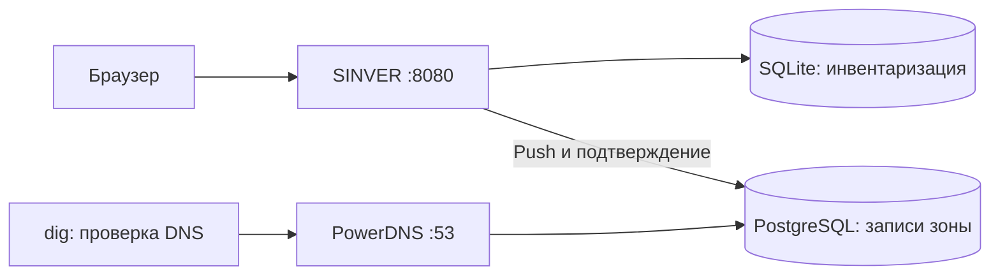

# 1. Быстрый старт

[← Назад](README_RU.md) · [Содержание](README_RU.md#содержание) · [Вперёд →](02_Configuration_RU.md)

В этой главе вы установите SINVER, подготовите тестовую зону PowerDNS и опубликуете в ней первый сервер. Пример рассчитан на **новую Ubuntu Server 24.04 LTS или Debian 12 с systemd**, доступом к пакетным репозиториям и правами `sudo`.

Все три компонента — SINVER, PostgreSQL и PowerDNS — устанавливаются на одной машине. PostgreSQL доступна на `127.0.0.1:5432`, PowerDNS отвечает на `127.0.0.1:53`, SINVER — на `127.0.0.1:8080`. Это учебный стенд: он не публикует DNS-зону в интернете.



> **Не выполняйте инструкции создания БД и замены конфигурации на действующем DNS-сервере.** Для существующей инфраструктуры сначала сделайте резервную копию и используйте отдельную тестовую зону. Особенности синхронизации описаны в [главе DNS](10_DNS_RU.md).

## 1.1. Установка SINVER

Обновите список пакетов и установите Git, GNU Make, Python, Flask, драйвер PostgreSQL и утилиты для HTTP/DNS-проверок:

```bash
sudo apt update
sudo apt install git make python3 python3-flask python3-psycopg2 curl dnsutils
```

Python должен быть версии **3.11 или новее**: приложение использует встроенный модуль `tomllib`. Проверьте интерпретатор и зависимости:

```bash
/usr/bin/python3 --version
/usr/bin/python3 -c 'import flask, psycopg2, tomllib; print("Зависимости доступны")'
```

Ожидаемый результат: `Python 3.12.x` на Ubuntu 24.04 либо `Python 3.11.x` на Debian 12 и строка `Зависимости доступны`. `ModuleNotFoundError` означает, что соответствующий пакет не установлен для этого интерпретатора.

Получите только ветку `doc` и перейдите в её каталог:

```bash
git clone --single-branch --branch doc https://github.com/dvoropaev/SINVER.git
cd SINVER
```

Для закрытого репозитория используйте разрешённый вашей организацией способ доступа к GitHub. Проверьте выбранную ветку:

```bash
git branch --show-current
```

Ожидаемый вывод: `doc`.

Установите приложение и включите его запуск вместе с системой:

```bash
sudo make install
sudo systemctl enable --now sinver.service
```

`make install` создаёт непривилегированную служебную учётную запись `sinver`, копирует программу в `/usr/bin/sinver`, конфигурацию в `/etc/sinver.toml`, схему БД в `/usr/share/sinver/` и устанавливает unit systemd. Существующий конфигурационный файл сохраняется. `systemctl enable --now` включает автозапуск и запускает сервис. При первом запуске SINVER сам создаёт SQLite-базу; вручную выполнять `init_db.sql` не требуется.

Проверьте сервис и HTTP-интерфейс:

```bash
systemctl is-active sinver.service
curl -sS -o /dev/null -w '%{http_code}\n' http://127.0.0.1:8080/servers
```

Ожидаемый результат: `active` и `200`. Код `503` означает режим обслуживания БД; смотрите [обслуживание и восстановление](02_Configuration_RU.md). Если сервис не запустился, прочитайте сообщения systemd и журнал приложения:

```bash
sudo journalctl -u sinver.service -n 30 --no-pager
sudo tail -n 30 /var/log/sinver/sinver.log
```

В успешном запуске журнал приложения содержит `SINVER started successfully: http://127.0.0.1:8080`. При ошибке ищите сообщение о конфигурации, правах на файлы или состоянии БД; конкретный текст указывает причину.

На машине с браузером откройте `http://127.0.0.1:8080`. Если SINVER установлен на удалённом сервере, адрес `127.0.0.1` относится к тому серверу. Для временного доступа создайте SSH-туннель **на своём компьютере**:

```bash
ssh -N -L 18080:127.0.0.1:8080 user@server
```

Замените `user@server` своей SSH-учётной записью и адресом сервера. Команда пересылает локальный порт `18080` в SINVER через SSH; пока она работает, открывайте `http://127.0.0.1:18080`. Для постоянного доступа по доменному имени выполните следующий раздел.

## 1.2. NGINX, HTTPS и авторизация — для доступа извне

**Этот раздел необязателен при локальной работе или доступе через SSH-туннель.** NGINX принимает внешние HTTPS-запросы, проверяет логин и пароль и передаёт их локальному SINVER. Все допущенные пользователи получают одинаковые права: Basic Auth не создаёт роли внутри приложения.

Для примера ниже нужно настоящее имя вместо `sinver.example.org`:

- его публичная A-запись должна указывать на внешний IPv4-адрес сервера;
- если есть AAAA-запись, сервер должен быть доступен также по этому IPv6;
- входящие TCP-порты `80` и `443` должны быть разрешены в межсетевом экране, security group и, при наличии, NAT;
- в `/etc/sinver.toml` оставьте `http_addr = "127.0.0.1"`; порт `8080` не публикуйте.

Установите NGINX, утилиту создания пароля и Certbot:

```bash
sudo apt install nginx apache2-utils certbot
```

Создайте файл паролей с учётной записью `admin`. Пароль вводится интерактивно:

```bash
sudo htpasswd -c /etc/nginx/sinver.htpasswd admin
sudo chown root:www-data /etc/nginx/sinver.htpasswd
sudo chmod 640 /etc/nginx/sinver.htpasswd
```

Флаг `-c` **создаёт новый файл и перезаписывает старый**. Для добавления следующих пользователей вызывайте `htpasswd` без `-c`. Права дают NGINX возможность читать файл и закрывают доступ остальным пользователям ОС.

Подготовьте каталог для проверки владения доменом Let's Encrypt и откройте новый конфигурационный файл:

```bash
sudo install -d -m 0755 /var/www/letsencrypt
sudoedit /etc/nginx/sites-available/sinver
```

На время выпуска сертификата сохраните такой HTTP-сайт, подставив своё доменное имя:

```nginx
server {
    listen 80;
    server_name sinver.example.org;

    location ^~ /.well-known/acme-challenge/ {
        auth_basic off;
        root /var/www/letsencrypt;
        try_files $uri =404;
    }

    location / {
        return 404;
    }
}
```

Путь `/.well-known/acme-challenge/` обслуживает проверку HTTP-01 без пароля. Остальные пути пока возвращают `404`. Если используете публичный IPv6, добавьте `listen [::]:80;`.

Включите сайт, проверьте синтаксис и примените конфигурацию:

```bash
sudo ln -s /etc/nginx/sites-available/sinver /etc/nginx/sites-enabled/sinver
sudo nginx -t
sudo systemctl reload nginx
```

Ссылку создают один раз. Ожидаемый итог `nginx -t`: `syntax is ok` и `test is successful`. При ошибке сначала исправьте названный файл и строку, затем повторите проверку.

Выпустите сертификат способом `webroot`; Certbot поместит проверочные файлы в подготовленный каталог:

```bash
sudo certbot certonly --webroot -w /var/www/letsencrypt -d sinver.example.org
```

Замените доменное имя своим; в интерактивном диалоге укажите адрес электронной почты и прочитайте условия сервиса. Успешный результат содержит `Successfully received certificate`. Сертификат и ключ находятся в `/etc/letsencrypt/live/<ваше-имя>/`.

Снова откройте `/etc/nginx/sites-available/sinver` командой `sudoedit` и замените содержимое конфигурацией ниже. Подставьте настоящее имя в `server_name` и в оба пути сертификата:

```nginx
server {
    listen 80;
    server_name sinver.example.org;

    location ^~ /.well-known/acme-challenge/ {
        auth_basic off;
        root /var/www/letsencrypt;
        try_files $uri =404;
    }

    location / {
        return 301 https://$host$request_uri;
    }
}

server {
    listen 443 ssl;
    server_name sinver.example.org;

    ssl_certificate /etc/letsencrypt/live/sinver.example.org/fullchain.pem;
    ssl_certificate_key /etc/letsencrypt/live/sinver.example.org/privkey.pem;
    ssl_protocols TLSv1.2 TLSv1.3;

    location / {
        auth_basic "SINVER";
        auth_basic_user_file /etc/nginx/sinver.htpasswd;

        proxy_pass http://127.0.0.1:8080;
        proxy_set_header Host $host;
        proxy_set_header X-Real-IP $remote_addr;
        proxy_set_header X-Forwarded-For $proxy_add_x_forwarded_for;
        proxy_set_header X-Forwarded-Proto $scheme;
        proxy_cookie_flags session secure;
    }
}
```

HTTP-сайт перенаправляет браузер на HTTPS, сохраняя доступ к ACME-проверке. HTTPS-сайт предъявляет сертификат, требует пароль и передаёт запросы в SINVER. `proxy_cookie_flags` добавляет флаг `Secure` cookie сессии. При доступе по IPv6 добавьте `listen [::]:80;` и `listen [::]:443 ssl;` в соответствующие блоки.

Проверьте и примените итоговую конфигурацию:

```bash
sudo nginx -t
sudo systemctl reload nginx
curl -sS -o /dev/null -w '%{http_code}\n' https://sinver.example.org/servers
curl -sS -u admin -o /dev/null -w '%{http_code}\n' https://sinver.example.org/servers
```

Ожидается успешная проверка NGINX, затем `401` без учётных данных и `200` с верным паролем. Последний `curl` запросит пароль; не записывайте его в командной строке. Теперь можно открывать `https://<ваше-имя>` в браузере.

Для загрузки нового сертификата после продления создайте deploy hook:

```bash
sudo install -d -m 0755 /etc/letsencrypt/renewal-hooks/deploy
sudoedit /etc/letsencrypt/renewal-hooks/deploy/reload-nginx.sh
```

Содержимое скрипта:

```sh
#!/bin/sh
set -e
/usr/sbin/nginx -t
/usr/bin/systemctl reload nginx
```

Сделайте скрипт исполняемым, включите таймер и проверьте пробное продление:

```bash
sudo chmod 750 /etc/letsencrypt/renewal-hooks/deploy/reload-nginx.sh
sudo systemctl enable --now certbot.timer
sudo certbot renew --dry-run
```

Ожидаемый итог: сообщение об успешном пробном продлении всех сертификатов, например `all simulated renewals succeeded`. `--dry-run` не заменяет рабочий сертификат и обычно не запускает deploy hook. TCP-порт `80` и ACME-путь должны оставаться доступными для последующих продлений.

## 1.3. PostgreSQL и PowerDNS

**PowerDNS Authoritative Server** отвечает за записи вашей зоны. **PostgreSQL** хранит его зоны и записи. SINVER подключается прямо к этой БД; API PowerDNS в текущей версии не используется.

Установите сервер PostgreSQL и PostgreSQL-бэкенд PowerDNS. Остановите PowerDNS до завершения настройки:

```bash
sudo apt install postgresql pdns-server pdns-backend-pgsql
sudo systemctl stop pdns.service
sudo systemctl enable --now postgresql.service
```

Создайте владельца БД `pdns` и базу `powerdns`. Пароль задаётся интерактивно; запомните его для настройки PowerDNS:

```bash
sudo -u postgres createuser --pwprompt pdns
sudo -u postgres createdb --owner=pdns powerdns
```

Инициализируйте **новую пустую** базу схемой из пакета PowerDNS:

```bash
psql -h 127.0.0.1 -U pdns -d powerdns -W -v ON_ERROR_STOP=1 -f /usr/share/pdns-backend-pgsql/schema/schema.pgsql.sql
```

Команда запрашивает пароль `pdns`, создаёт таблицы PowerDNS и останавливается при первой SQL-ошибке. Это схема PowerDNS; она не связана с `database/init_db.sql` из SINVER.

Создайте отдельный логин `sinver_dns` для SINVER:

```bash
sudo -u postgres createuser --pwprompt sinver_dns
sudo -u postgres psql -d powerdns -v ON_ERROR_STOP=1
```

Первая команда задаёт отдельный пароль, вторая открывает SQL-консоль администратора. Выполните в ней:

```sql
GRANT CONNECT ON DATABASE powerdns TO sinver_dns;
GRANT USAGE ON SCHEMA public TO sinver_dns;
GRANT SELECT ON TABLE domains TO sinver_dns;
GRANT SELECT, INSERT, DELETE ON TABLE records TO sinver_dns;
GRANT USAGE ON SEQUENCE records_id_seq TO sinver_dns;
\q
```

Эти права позволяют читать зоны и записи, удалять и добавлять записи, получать ID из последовательности. `\q` закрывает консоль. **Логин имеет доступ ко всем записям этой БД**, поэтому используйте отдельную БД/стенд для примера, а не учётную запись суперпользователя.

Откройте основной файл PowerDNS:

```bash
sudoedit /etc/powerdns/pdns.conf
```

Для новой тестовой установки замените содержимое следующим, подставив пароль учётной записи `pdns`:

```ini
launch=gpgsql
gpgsql-host=127.0.0.1
gpgsql-port=5432
gpgsql-dbname=powerdns
gpgsql-user=pdns
gpgsql-password=ЗАМЕНИТЕ_ПАРОЛЕМ_PDNS
local-address=127.0.0.1
local-port=53
```

`gpgsql-*` задают подключение PowerDNS к БД. `local-address` ограничивает DNS-ответы локальной машиной. Пример не подключает дополнительные файлы через `include-dir`; настройки из прежних подключаемых файлов здесь не используются. Для пароля избегайте переводов строк и символов, которые интерпретируются конфигурационным файлом как комментарий.

Закройте файл с паролем от посторонних и запустите PowerDNS:

```bash
sudo chown root:pdns /etc/powerdns/pdns.conf
sudo chmod 640 /etc/powerdns/pdns.conf
sudo systemctl enable --now pdns.service
systemctl is-active pdns.service
```

Ожидаемый результат проверки: `active`. При другом результате прочитайте журнал:

```bash
sudo journalctl -u pdns.service -n 30 --no-pager
```

При успешном запуске в нём есть сообщения о загрузке `gpgsql` и готовности к запросам. Ошибки подключения обычно указывают на имя БД, пароль или правила `pg_hba.conf`; `Address already in use` означает, что выбранный DNS-адрес/порт занят. Не включайте `trust` и не открывайте PostgreSQL всему интернету для обхода ошибки.

## 1.4. Создание учебной DNS-зоны

Следующие команды рассчитаны на PowerDNS **4.7/4.8 из указанных дистрибутивов**. Создайте зону `infra.example.net`, укажите её сервер имён и режим `NATIVE` — без передачи зоны вторичным серверам:

```bash
sudo pdnsutil create-zone infra.example.net ns1.infra.example.net
sudo pdnsutil set-kind infra.example.net NATIVE
sudo pdnsutil replace-rrset infra.example.net infra.example.net SOA 3600 'ns1.infra.example.net. hostmaster.infra.example.net. 1 3600 600 1209600 300'
sudo pdnsutil replace-rrset infra.example.net ns1.infra.example.net A 3600 192.0.2.53
```

`create-zone` создаёт зону с SOA/NS, `set-kind` задаёт тип, `replace-rrset` заменяет указанный набор записей. SOA здесь имеет SERIAL `1`, REFRESH `3600`, RETRY `600`, EXPIRE `1209600`, MINIMUM `300`; их смысл разобран в [главе Zones](09_Zones_RU.md). A-запись `ns1` использует учебный адрес и не делает этот адрес доступным DNS-сервером. DNSSEC в этом стенде не включается.

Проверьте структуру зоны и ответы PowerDNS:

```bash
sudo pdnsutil check-zone infra.example.net
dig @127.0.0.1 infra.example.net SOA +short
dig @127.0.0.1 infra.example.net NS +short
```

Ожидается отсутствие ошибок проверки зоны и ответы примерно такого вида:

```text
ns1.infra.example.net. hostmaster.infra.example.net. 1 3600 600 1209600 300
ns1.infra.example.net.
```

Если PowerDNS нормализовал представление имён, сравнивайте значения полей. `+short` показывает только ответ; при пустом выводе повторите `dig` без `+short`, чтобы увидеть статус (`NXDOMAIN`, `SERVFAIL`) или сообщение о недоступности сервера.

Проверьте доступ SINVER к таблицам от имени его PostgreSQL-логина:

```bash
psql -h 127.0.0.1 -U sinver_dns -d powerdns -W -c 'SELECT name, type FROM domains;'
```

Ожидается строка `infra.example.net | NATIVE`. Ошибка `permission denied` требует проверки выданных прав; ошибка аутентификации — пароля и правил PostgreSQL для `127.0.0.1`.

## 1.5. Первая зона и первый сервер в SINVER

Откройте **Zones**, заполните **Add zone** и нажмите **Create**:

| Поле | Значение для стенда |
| --- | --- |
| Zone | `infra.example.net` — без завершающей точки |
| MNAME | `ns1.infra.example.net.` |
| RNAME | `hostmaster.infra.example.net.` |
| SERIAL | `1` — как в ответе SOA выше |
| REFRESH / RETRY / EXPIRE / MINIMUM | `3600` / `600` / `1209600` / `300` |
| PostgreSQL address | `127.0.0.1` |
| DB name | `powerdns` |
| PostgreSQL user | `sinver_dns` |
| PostgreSQL password | Пароль логина `sinver_dns` |
| Description | `Учебная зона` — необязательно |

Создайте сервер на вкладке **Servers → Add server**:

| Поле | Значение |
| --- | --- |
| Hostname | `app-01` |
| Primary zone | `infra.example.net` |
| Role / Hosting | `None` — можно заполнить позже |
| Description | `Первый сервер приложения` — необязательно |

Нажмите **Create**. На вкладке **IP addresses → Add IP** добавьте его основной адрес:

| Поле | Значение |
| --- | --- |
| Type | `IPv4` |
| IP | `192.0.2.10` |
| Server | `app-01` |
| Role | `None` |
| Primary | `Yes` |

Нажмите **Create**. Связка основной зоны сервера и основного IP формирует запись `app-01.infra.example.net A 192.0.2.10` при публикации.

**Сохраните в инвентаризации адрес сервера имён.** Тем же способом создайте сервер `ns1` с основной зоной `infra.example.net` и его primary IPv4 `192.0.2.53`. Без этой связки SINVER сочтёт существующую A-запись `ns1` лишней и предложит удалить её. NS-запись при этом сохраняется, поскольку SINVER не управляет типом NS.

Чтобы добавить удобное имя приложения:

1. На вкладке **Subdomains → Add subdomain** задайте **Type** `A`, **Name** `app`, **Zone** `infra.example.net`, **Role** `None` и нажмите **Create**.
2. Откройте созданную карточку по ссылке `app`, нажмите **Edit**.
3. Выберите `192.0.2.10` в **Linked IP addresses** и нажмите **Save**.

После привязки адреса SINVER будет формировать дополнительную запись `app.infra.example.net A 192.0.2.10`.

## 1.6. Отправка записей в PowerDNS

1. Откройте **DNS**, в блоке **PowerDNS + PostgreSQL** выберите `infra.example.net` и нажмите **Push**. Это пока только подготовка плана.
2. Сверьте **Remote SERIAL** и **Local SERIAL**. В нашем примере оба равны `1`. При расхождении выясните причину; не продолжайте автоматически.
3. Изучите предварительный список изменений и SQL. Должны появиться адресные записи `app-01` и `app`; SOA получит новый SERIAL. A-запись `ns1` и NS должны остаться. Возможны замены записей из-за различий TTL или служебных значений.
4. Если план соответствует намерению, нажмите **Confirm apply** и подтвердите диалог браузера. Ожидаемое сообщение: `PowerDNS update applied and local serial updated.`

> **Проверяйте каждое удаление в плане.** Для выбранной зоны SINVER управляет всем набором A/AAAA/SOA, а не только записями, созданными ранее через SINVER. Полный порядок действий и обработка ошибок — в [главе DNS](10_DNS_RU.md).

Для изолированного тестового сервера очистите DNS-кеш PowerDNS и запросите опубликованные записи:

```bash
sudo pdns_control purge 'infra.example.net$'
dig @127.0.0.1 app-01.infra.example.net A +short
dig @127.0.0.1 app.infra.example.net A +short
dig @127.0.0.1 ns1.infra.example.net A +short
dig @127.0.0.1 infra.example.net SOA +short
```

`purge` с суффиксом `$` очищает кеш записей этой зоны на данном PowerDNS. Ожидается сообщение `purged …` с числом удалённых элементов кеша; ноль допустим, если кеш пуст. Первые три DNS-запроса должны вернуть `192.0.2.10`, `192.0.2.10` и `192.0.2.53`. В SOA должен быть SERIAL из поля **New SERIAL** подтверждённого плана. Он имеет формат `YYMMDDhhmm`, например `2610071430`; время берётся с хоста SINVER. Запросы к другим DNS-серверам могут показывать прежний ответ до истечения TTL.

Это проверяет публикацию DNS, но не доступность самих серверов: в примере использованы адреса для документации. Для реальной инфраструктуры замените их рабочими адресами и отдельно проверьте сетевую доступность служб.

## Справочные источники

Рецепты внешних компонентов опираются на их документацию: [NGINX — Basic Auth](https://nginx.org/en/docs/http/ngx_http_auth_basic_module.html), [NGINX — reverse proxy и cookie](https://nginx.org/en/docs/http/ngx_http_proxy_module.html), [Certbot — webroot и продление](https://eff-certbot.readthedocs.io/en/stable/using.html#webroot), [PowerDNS — PostgreSQL backend](https://doc.powerdns.com/authoritative/backends/generic-postgresql.html), [PowerDNS 4.7 — pdnsutil](https://manpages.debian.org/bookworm/pdns-server/pdnsutil.1.en.html), [Debian — установка PostgreSQL backend и путь схемы](https://sources.debian.org/src/pdns/4.7.3-2/debian/pdns-backend-pgsql.README.Debian/), [PostgreSQL — GRANT](https://www.postgresql.org/docs/current/sql-grant.html). Для PowerDNS 5.x [синтаксис `pdnsutil` изменён](https://doc.powerdns.com/authoritative/upgrading.html#pdnsutil-syntax-and-behaviour-changes); этот пример рассчитан на пакеты 4.7/4.8.

[← Назад](README_RU.md) · [Содержание](README_RU.md#содержание) · [Вперёд →](02_Configuration_RU.md)
