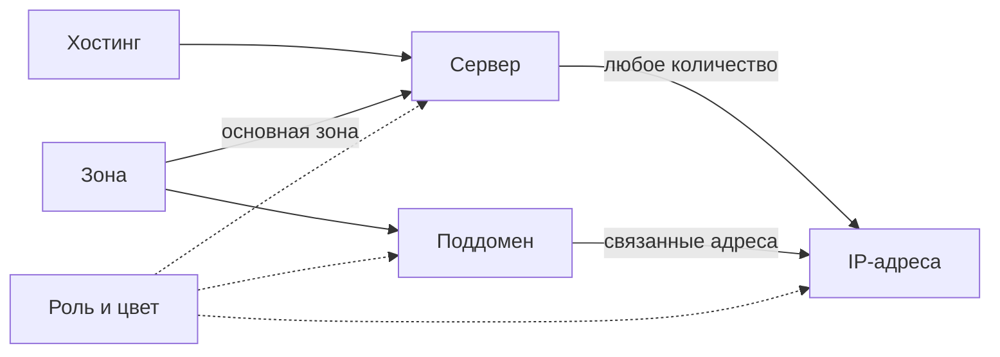

[Содержание](README_RU.md#содержание) · [Назад: Конфигурация](02_Configuration_RU.md) · [Далее: Серверы](04_Servers_RU.md)

# 3. Веб-интерфейс

## 3.1. Вход и навигация

Откройте адрес, настроенный при [установке](01_Quick_Start_RU.md): локально — `http://127.0.0.1:8080`, через NGINX — HTTPS-адрес вашего сервера. Если в NGINX настроена HTTP Basic Auth, браузер запросит имя пользователя и пароль. Поля PostgreSQL во вкладке **Zones** относятся к отдельному подключению — базе PowerDNS.

При открытии корневого адреса SINVER показывает вкладку **Servers**. Верхнее меню доступно на всех основных страницах; текущая вкладка выделена цветом.

| Вкладка | Назначение | Путь |
| --- | --- | --- |
| [Servers](04_Servers_RU.md) | Каталог серверов, их размещение и связанные IP-адреса и поддомены | `/servers` |
| [IP addresses](05_IP_Addresses_RU.md) | IPv4- и IPv6-адреса серверов и выбор основного адреса | `/ips` |
| [Subdomains](06_Subdomains_RU.md) | Дополнительные DNS-имена, связанные с одним или несколькими адресами | `/subdomains` |
| [Roles](07_Roles_RU.md) | Справочник назначений объектов и цветов | `/roles` |
| [Hostings](08_Hostings_RU.md) | Сведения о площадках, ссылки и даты оплаты | `/hostings` |
| [Zones](09_Zones_RU.md) | DNS-зоны, параметры SOA и подключение к PostgreSQL PowerDNS | `/zones` |
| [DNS](10_DNS_RU.md) | Просмотр плана изменений, публикация в PowerDNS и выгрузка файла зоны для BIND9 | `/dns` |

У новой установки таблицы пусты.

## 3.2. Как связаны данные

**Сервер** — запись о машине, например `web01`. **IP-адрес** принадлежит одному серверу. **Поддомен** связывает имя в зоне с адресами; эти адреса могут принадлежать разным серверам. **Зона** задаёт общую часть DNS-имени, например `example.net`.

Серверу можно назначить одну основную зону, одну роль и один хостинг. Эти связи необязательны. IP-адрес обязательно принадлежит одному серверу; поддомен — одной зоне. Собственную роль можно назначить серверу, IP-адресу и поддомену независимо.

Например, у сервера `web01` с основной зоной `example.net` есть основной адрес `192.0.2.10`. Для него SINVER формирует запись `web01.example.net A 192.0.2.10`. Если создать поддомен `api` в той же зоне и связать его с этим адресом, появится ещё одна запись: `api.example.net A 192.0.2.10`.

Первые шесть вкладок изменяют данные в собственной базе SQLite. Роли и хостинги помогают организовать каталог; сами по себе они не создают DNS-записи.

Чтобы изменения стали доступны в PowerDNS, отдельно опубликуйте их во вкладке **DNS**. Для BIND9 выгрузите файл зоны и установите его по [инструкции главы DNS](10_DNS_RU.md). Учёт сервера, сохранение формы и публикация DNS — отдельные действия.

| Термин | Значение |
| --- | --- |
| FQDN | Полное доменное имя, например `api.example.net` |
| A / AAAA | DNS-запись для IPv4 / IPv6 соответственно |
| Primary zone | Основная зона сервера; используется для имени `<Hostname>.<зона>` |
| Primary IP | Единственный выбранный основной адрес сервера; из него формируется адресная запись имени сервера |
| SOA | Служебная запись зоны с параметрами её обновления |
| SERIAL | Номер версии зоны внутри SOA; используется при проверке изменений перед публикацией |
| TTL | Время хранения записи в DNS-кэше, в секундах |

Для первого заполнения удобно создать **зону**, затем при необходимости **роли** и **хостинг**, после этого **сервер**, его **IP-адреса** и **поддомены**. Проверку и отправку DNS выполняйте последними.

## 3.3. Список, фильтры и карточка

На вкладках учёта размещены фильтры, таблица объектов и форма добавления. Нажмите на имя объекта или IP-адрес в таблице, чтобы открыть его карточку. В карточке видны поля объекта и связанные записи; ссылки на связанные объекты позволяют переходить между ними.

| Элемент | Назначение |
| --- | --- |
| `Any` | Не ограничивать список данным фильтром |
| `None` | Не назначать необязательную связь, например роль или хостинг |
| `… contains` | Найти строки, в которых поле содержит введённый фрагмент |
| `Sort by` | Выбрать поле сортировки; порядок возрастающий |
| `Apply` | Применить фильтры и сортировку; данные объектов не изменяются |
| `Reset` | Открыть полный список с настройками по умолчанию |
| `—` | Значение отсутствует или у объекта нет связанных записей |

Несколько фильтров действуют одновременно: строка должна удовлетворять каждому из них. Текстовый поиск использует шаблоны SQLite: `%` соответствует любому числу символов, `_` — одному символу. Для обычного поиска вводите часть имени без этих знаков. Текстовые поля сравниваются как строки; адреса не сортируются по их числовому значению.

В текущей версии поле `Sort by` после применения снова показывает первый вариант, хотя список отсортирован по выбранному полю; при следующем нажатии `Apply` выберите его заново. У вкладки Roles есть отдельная ошибка фильтра цвета; обход приведён в [главе о ролях](07_Roles_RU.md).

## 3.4. Создание, изменение и удаление

**Создание:** заполните форму `Add …` под таблицей и нажмите `Create`. Обязательность и допустимые значения полей описаны в главе соответствующей вкладки. Сообщение об успехе подтверждает сохранение в SQLite.

**Изменение:** откройте карточку, нажмите `Edit`, измените поля и нажмите `Save`. До нажатия `Edit` поля закрыты для редактирования. Чтобы отказаться от несохранённых изменений, обновите страницу или перейдите на другую вкладку. Отдельной кнопки отмены нет.

**Удаление:** в карточке нажмите `Delete …` и подтвердите действие в окне браузера. Некоторые удаления также удаляют связанные адреса или связи. Последствия перечислены в каждой главе. Кнопки отмены уже выполненного удаления нет; для восстановления воспользуйтесь [резервной копией](02_Configuration_RU.md#ручное-восстановление-sqlite).

> **Удаление из SINVER не удаляет запись из PowerDNS немедленно.** Чтобы привести DNS к новому состоянию каталога, заново сформируйте и проверьте план во вкладке DNS.

В многострочном поле **Description** можно хранить пояснения на русском и других языках. В некоторых таблицах и подсказках видны только первые 50 символов; полное описание доступно в карточке. Пароли и другие секреты не записывайте в описания.

## 3.5. Цветовые обозначения

Цветной кружок обозначает назначение объекта. Роль — метка, например `Web` или `Database`, и не предоставляет права доступа. IP-адреса и поддомены могут наследовать цвет связанных объектов, хотя их собственное поле `Role` пусто. Точные правила и примеры приведены в [главе Roles](07_Roles_RU.md).

## 3.6. Сообщения и восстановление работы

| Сообщение или состояние | Что означает и что делать |
| --- | --- |
| Зелёное сообщение `… created`, `… updated`, `… deleted` | Соответствующая операция учёта завершена. Для DNS требуется отдельная публикация |
| Красное сообщение | Операция завершилась с ошибкой либо требуется дополнительное решение. Прочитайте текст; ошибки публикации разобраны в [главе DNS](10_DNS_RU.md) |
| HTTP 400, `CSRF validation failed` | Открытая форма больше не соответствует браузерной сессии. Обновите страницу, заново заполните форму и отправьте её |
| HTTP 500, `Internal error` | SINVER не обработал запрос. Проверьте результат в списке объектов перед повторением операции; используйте [главу текущих проблем](11_Current_Issues_RU.md) для известных причин |
| HTTP 503, `Maintenance mode` | Основной интерфейс заблокирован проверкой или подготовкой базы; действия описаны ниже |

Для работы с формами браузер должен принимать cookie SINVER, а для `Edit` и подтверждения удаления — выполнять JavaScript. После перезапуска SINVER **обновите открытые страницы**: подпись сессии меняется, прежние формы будут отклонены защитой CSRF. CSRF-защита проверяет токен браузерной сессии; аутентификацию пользователей она не обеспечивает.

В SINVER нет встроенных учётных записей, разграничения прав и режима только чтения. Каждый, кто получил доступ к интерфейсу, может изменять данные и выполнять операции DNS. Для внешнего доступа настройте HTTPS и HTTP Basic Auth в NGINX по [инструкции установки](01_Quick_Start_RU.md).

### Maintenance mode

При запуске SINVER автоматически создаёт отсутствующую SQLite-базу и проверяет её целостность, структуру и версию. Если проверка не завершилась успешно, вместо любой основной страницы показывается `Maintenance mode` со статусом HTTP 503.

1. Прочитайте сообщение: оно указывает причину блокировки, версию базы и версию приложения.
2. Если предложена миграция, проверьте план и путь резервной копии. Нажмите **«Подтвердить миграцию и создание резервной копии»**. До изменений SINVER сохраняет копию; при успехе открывает основной интерфейс.
3. Если показана ошибка, устраните её причину: например, права доступа, отсутствие файлов схемы или несовместимую версию базы. Затем перезапустите службу. Действия с файлами и журналами описаны в [конфигурации](02_Configuration_RU.md).

Для старой базы без служебной версии подтверждение добавляет метаданные версии `0.0.0`; произвольную схему приложение не исправляет. При ошибке миграции SINVER пытается восстановить сохранённую базу. Если восстановление не удалось, остановите службу и воспользуйтесь [порядком ручного восстановления SQLite](02_Configuration_RU.md#ручное-восстановление-sqlite). Список резервных копий на странице служит справкой; кнопки восстановления в интерфейсе нет.

[Содержание](README_RU.md#содержание) · [Назад: Конфигурация](02_Configuration_RU.md) · [Далее: Серверы](04_Servers_RU.md)
